# YamGroP: Yam Growth and development phenotyping pipeline

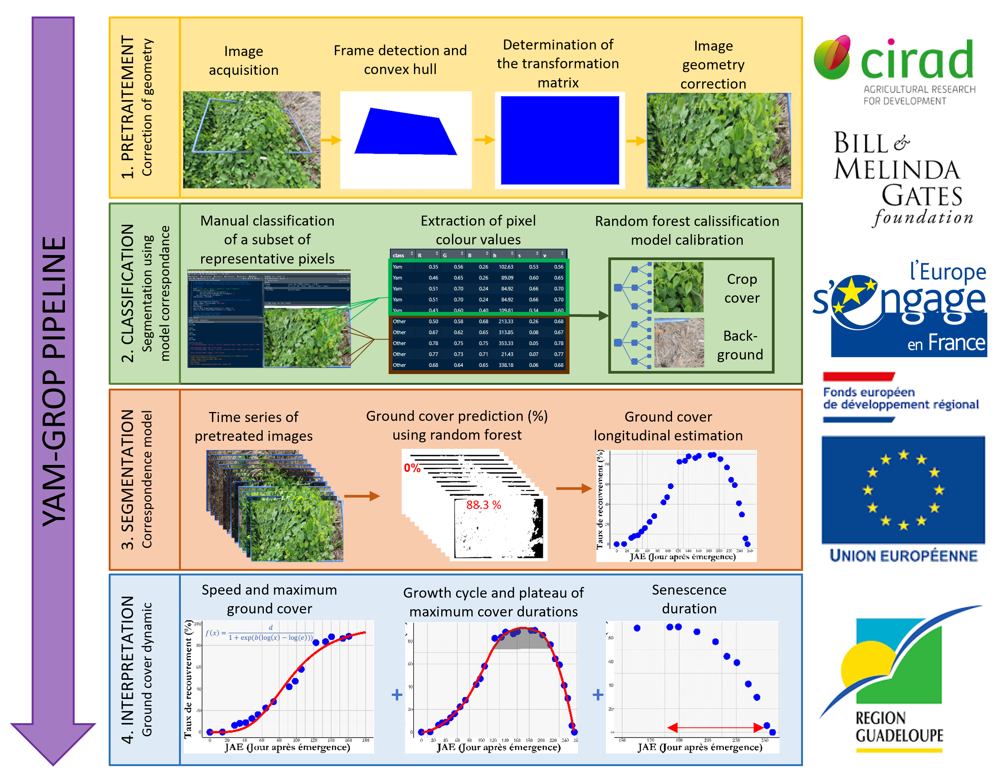  

<br>

# Table of Contents

1. [Overview](#overview)
   - [Projects](#projects)
   - [Running Example](#running-example)
2. [Build a Pixel Classifier to Segment the Blue Frame](#1-build-a-pixel-classifier-to-segment-the-blue-frame)
3. [Automated Frame Detection and Distortion Correction](#2-automated-frame-detection-and-distortion-correction)
4. [Image-Based Classification of Yam and Background Pixels Using Random Forest](#3-image-based-classification-of-yam-and-background-pixels-using-random-forest)
5. [Parallel Image Segmentation and Analysis for Estimating Yam Cover Percentage](#4-parallel-image-segmentation-and-analysis-for-estimating-yam-cover-percentage)
6. [Modeling and Analyzing Yam Ground Cover Dynamics](#5-modeling-and-analyzing-yam-ground-cover-dynamics)
7. [R Libraries Overview](#r-libraries-overview)
   - [Data Manipulation and Visualization](#data-manipulation-and-visualization)
   - [Image Processing](#image-processing)
   - [Color Science](#color-science)
   - [Machine Learning](#machine-learning)
   - [Parallel Computing](#parallel-computing)
   - [Miscellaneous](#miscellaneous)
8. [Installation](#installation)  

<br>

## Overview
YamGroP (Yam Growth and Development Phenotyping Pipeline) is designed to facilitate comprehensive phenotypic analysis of yams, focusing on emergence vigor, growth and senescence through a series of structured scripts. These scripts process raw image data, extract phenotypic information, and perform basic statistical analysis to understand genetic variations. This project focuses on image analysis. For more information on image acquisition and prerequisites report to the following standard operating protocole: 
<a href="https://github.com/dcornet/YamSCoP/blob/main/Docs/TODO.pdf">
  
</a>  

<br>

### Projects
This work was developed as part of two projects funded by the Bill and Melinda Gates foundation and the European Union: 
* [CavalBio](https://www.cirad.fr/en/worldwide/cirad-worldwide/projects/cavalbio-project): CAVALBIO is working to develop sustainable citrus and yam value chains in Guadeloupe, by focusing on disease tolerance/resistance, adaptation to low-input production systems, product quality, and extending production periods. Genetic improvement operations centre on using the biodiversity of cultivated species and their nearest relatives. To this end, various parents have been crossed. The resulting selected hybrids often have more than two sets of chromosomes (polyploidy), since this generally ensures better tolerance of various types of stress. High-resolution genetic maps and collections of genetic markers have been built for the parents concerned. Using these resources, the recombination of genetic characters within the populations of progenies can be retraced precisely, to select the best genotypes in terms of adaptation and production. The structures and mechanisms responsible for the elaboration of worthwhile characters, on a cell and tissue level, and the effect of polyploidy on those characters are also being studied. Project start date: 01/01/2018 Project end date: 31/12/2020
* [AfricaYam](https://africayamphase2.com/): This IITA-led aims at increasing yam productivity whilst reducing production costs and environmental impact by developing and deploying end-user preferred varieties with higher yield, greater resistance to pests and diseases and improved quality. This project involves a network of research organizations in the four main producer countries of the yam belt: the National Root Crops Research Institute (NRCRI) and the Ebonyi State University (EBSU) in Nigeria; two research institutes under the Council for Scientific and Industrial Research (CSIR) in Ghana (the Crops Research Institute and the Savanna Agricultural Research Institute; the Centre National de Recherche Agronomique (CNRA), Côte d'Ivoire; and the Université d'Abomey-Calavi (UAC), Dassa Center, Benin.
* [RTB Breeding Network](https://www.cgiar.org/news-events/news/rtb-breeding-network-formalizes-collaboration-to-accelerate-genetic-gains-for-smallholder-farmers-in-sub-saharan-africa/): The RTB Breeding Network is a collaborative effort between CGIAR centers, CIP and IITA, 18 National Agricultural Research and Extension Systems (NARES), and Universities across Sub-Saharan Africa. The network focuses on breeding key staple crops, including banana, cassava, potato, sweet potato, and yam, to accelerate the delivery of genetic gains on farms that improve smallholder farmers’ resilience, productivity, and livelihoods. The network’s activities align with a broader vision to foster climate resilience, alleviate poverty, and ensure food security by delivering improved crop varieties better suited to changing climate conditions and the needs of smallholder farmers. RTB crops are expected to expand significantly, with production forecasts indicating that they will surpass the combined output and value of other staple crops in Sub-Saharan Africa by 2050.

<br>

### Running example
To help you understand and use the analysis pipeline, emergence dates are provided in a data frame [./data/Emergence.csv](./data/Emergence.csv) and a set of ground cover images is provided in the [./data/GC_Pics_Example](./data/GC_Pics_Example) directory. It includes 5 yam genotypes followed every 15 days during the whole cropping season, from emergence up to complete senescence. Ground base images were taken using diffrent sensor (smartphone or camera). All other files provided in the [./out/](./out/) directory can be produced by the pipeline. Having them available allows the user to test the different pipeline modules independently.  

<br>

## 1. Build a pixel classifier to segment the blue frame 
This R script is designed to classify pixels in images into two categories: "Frame" and "Background," using color data and a Random Forest classifier. The process involves loading necessary libraries, collecting pixel data from images, transforming color data into various color spaces, and training a classifier.

The script begins by loading and installing the required libraries, including tidyverse for data manipulation, imager for image processing, randomForest for building the classification model, and other utilities like tripack, colorscience, and crayon for additional functionalities. The function install_if_necessary ensures that each package is installed and loaded.

Next, the script focuses on data collection for classification. The user is prompted to select an image file, which is then resized to 600x400 pixels for consistency. The user manually selects pixels corresponding to the "Frame" and "Background" categories using the locator() function. These selections are crucial as they form the basis for the training dataset. For each selected pixel, the RGB color values and their coordinates are recorded, along with the class label (either "Frame" or "Background").  
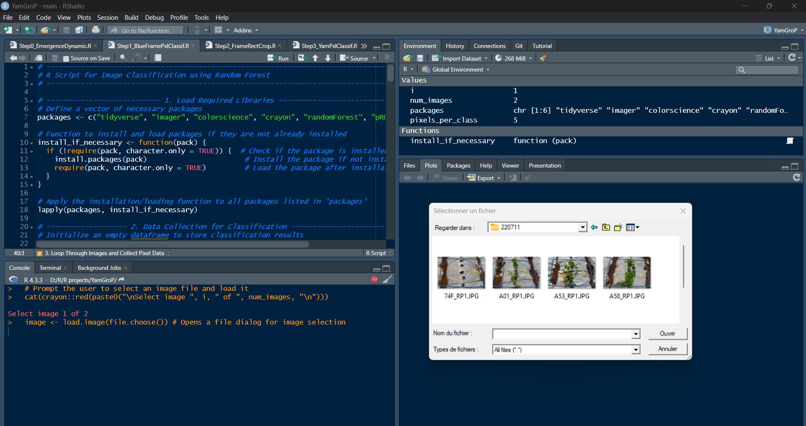  

The collected data is then transformed to include additional color space representations. Specifically, RGB values are converted into HSV, XYZ, and Lab color spaces, providing a richer set of features for the classification model. The script also calculates derived color features, such as the ratio of red to green (r.g) and a metric combining green, red, and blue values (g2rb). These transformations result in a comprehensive dataset with multiple color-related features.

Finally, the script trains a Random Forest classifier using the transformed data. The classifier is tuned with specific parameters, including the number of trees (ntree = 450) and the number of variables considered at each split (mtry = 5). The trained model's importance plot is displayed to show which features contribute most to the classification. The model is then saved to a file named "FramePixelClassifier.rds" for future use.
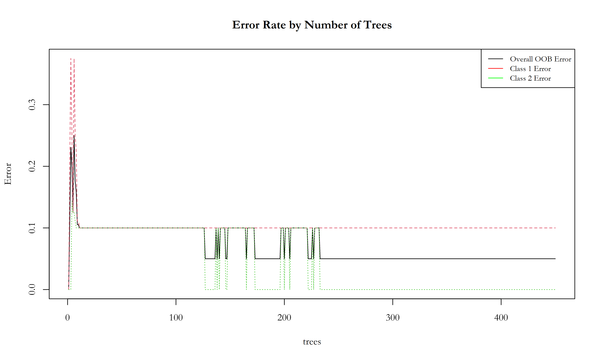  

The model overall performance can be visualize as a confusion matrix o by looking at the Receiver Operating Characteristic (ROC) curve:  
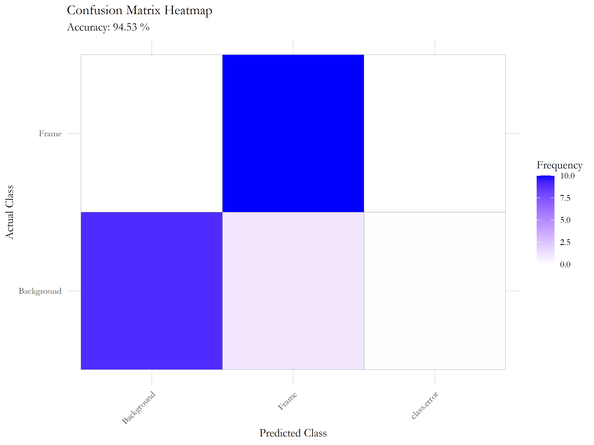    

The relative importance of each variable used in the classification model can be analyzed using the mean decrease accuracy or the Gini index. As we can see below, unsupprisingly, the most important variable to detect the frame is the blue value of the RGB color space:  
  

In summary, the script provides a workflow for manually collecting training data from images, transforming that data into a format suitable for machine learning, and training a classifier to distinguish between different parts of an image based on color information. The output includes the trained model, which can be used to classify pixels in new images based on their color characteristics.  

<br>

## 2. Automated Frame Detection and Distorsion Correction  
This R script is an advanced tool for detecting and extracting specific frame regions from a collection of images, utilizing color classification techniques and image processing algorithms.  
  

It begins by ensuring that all necessary libraries are available and loaded. The packages include tidyverse for data manipulation, imager for image processing, tripack for triangulation, colorscience for color conversions, parallel for parallel computing, ggplot2 for plotting, and randomForest for machine learning classification. The function install_if_necessary checks if each package is installed and loads it, installing it if necessary.

The next step involves gathering the image files from a specified directory. The script searches the directory "./data/GC_Pics_Example/" for files with a .JPG extension, storing their paths in the image_files list. This list serves as the input dataset for the frame detection process.

The core functionality is encapsulated in the FrameDetection function. This function is designed to process each image individually. It begins by loading an image and extracting its filename for use in saving outputs. The image is resized to a standard width, preserving its aspect ratio to ensure uniform processing across different images. This resized image is then converted into a data frame where each row corresponds to a pixel, storing its RGB values and coordinates.

To enhance the color data, the script transforms these RGB values into several other color spaces, including HSV, XYZ, and Lab. This transformation provides a richer feature set for subsequent analysis. Additional features are calculated, such as the red-green ratio (r.g) and the difference between green and the sum of red and blue components (g2rb). These derived metrics help differentiate between different areas of the image based on color properties.

For classification, the script uses a pre-trained Random Forest model stored in "FramePixelClassifier.rds". This model classifies each pixel as belonging to either the "Frame" or "Background" class. The classification results are refined through morphological operations to reduce noise and enhance the clarity of the detected frame. The script then uses a convex hull algorithm to define the outer boundary of the frame region, identifying the coordinates of the trapezoid that outlines the frame.

Following detection, the script performs a perspective transformation to correct any distortions, ensuring that the frame appears rectangular and properly aligned in the output. The corrected image is then saved, preserving only the region of interest. The coordinates of the frame corners are used to crop the image precisely, focusing on the frame area.

To handle multiple images efficiently, the script employs parallel processing. It detects the number of available CPU cores and sets up a computing cluster. The FrameDetection function is executed in parallel across the images listed in image_files using the parLapply function, which distributes the workload among the processors. This parallel execution significantly reduces processing time, making the script suitable for large-scale image datasets.

In summary, this script automates the process of identifying and extracting specific frame regions from images. By leveraging advanced image processing techniques and machine learning, it transforms the color data, classifies pixels, and applies geometric corrections to accurately extract the desired area. The use of parallel processing ensures that the script can handle large numbers of images efficiently, making it a powerful tool for batch processing tasks in image analysis.  
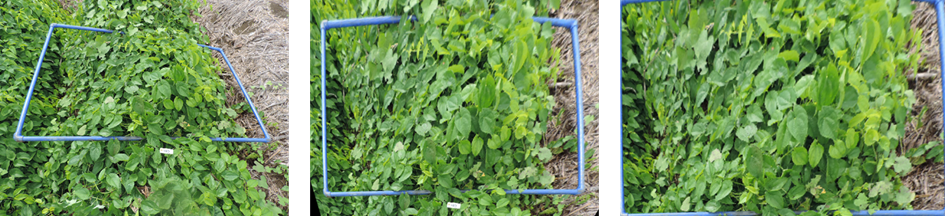  

<br>

## 3. Image-Based Classification of Yam and Background Pixels Using Random Forest

This R script focuses on classifying pixels in images into two categories: "Yam" and "Other," using a machine learning approach. The process involves loading necessary libraries, collecting color data from selected pixels in images, transforming this data into various color spaces, and training a Random Forest classifier.

The script starts by loading essential packages, such as tidyverse for data manipulation, imager for image processing, crayon for colored console output, colorscience for color conversions, and randomForest for building the classification model. The install_if_necessary function checks if each package is installed and loads it, installing it if necessary. This step ensures that all necessary tools are available for subsequent data processing and analysis.

The script collects data from one image, as indicated by the num_images variable. It prompts the user to select an image file, which is then displayed. The user is guided to select a specified number of pixels (pixels_per_class) that represent the "Yam" cover and the background ("Other") using the locator() function. These selections are stored along with their RGB values and pixel coordinates, creating a dataset with class labels "Y" for Yam and "O" for Other. This dataset serves as the training data for the classifier.

The script standardizes the data by converting the collected RGB values into other color spaces, such as HSV, XYZ, and Lab. This conversion provides a more comprehensive feature set, aiding in more accurate classification. Additional features are calculated, such as the red-green ratio (r.g) and the difference between green and the sum of red and blue values (g2rb). These features help differentiate the classes based on color properties. The dataset is prepared for modeling, with the class labels converted to a factor data type.

Using the prepared dataset, the script trains a Random Forest classifier to distinguish between "Yam" and "Other" pixels. The model is configured with specific parameters, including the number of trees (ntree = 300), the number of variables tried at each split (mtry = 5), and the minimum size of terminal nodes (nodesize = 3). The trained model is evaluated for its performance, and feature importance is assessed. The final model is saved as "YamPixelClassifier.rds" for future use.  

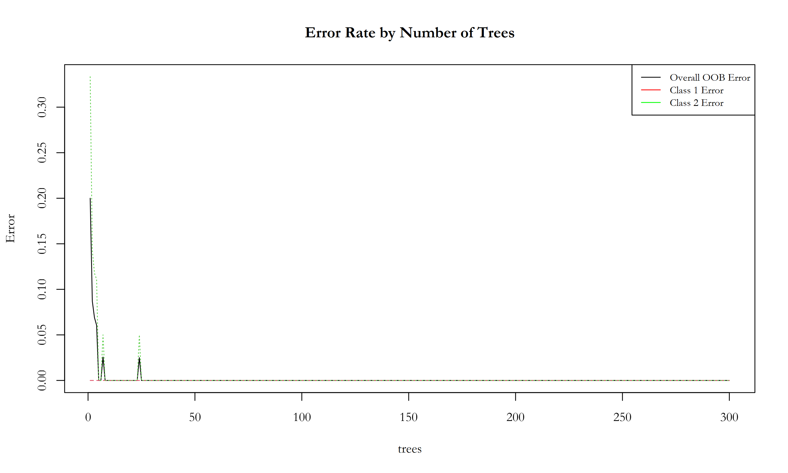  

The model overall performance can be visualize as a confusion matrix o by looking at the Receiver Operating Characteristic (ROC) curve:  
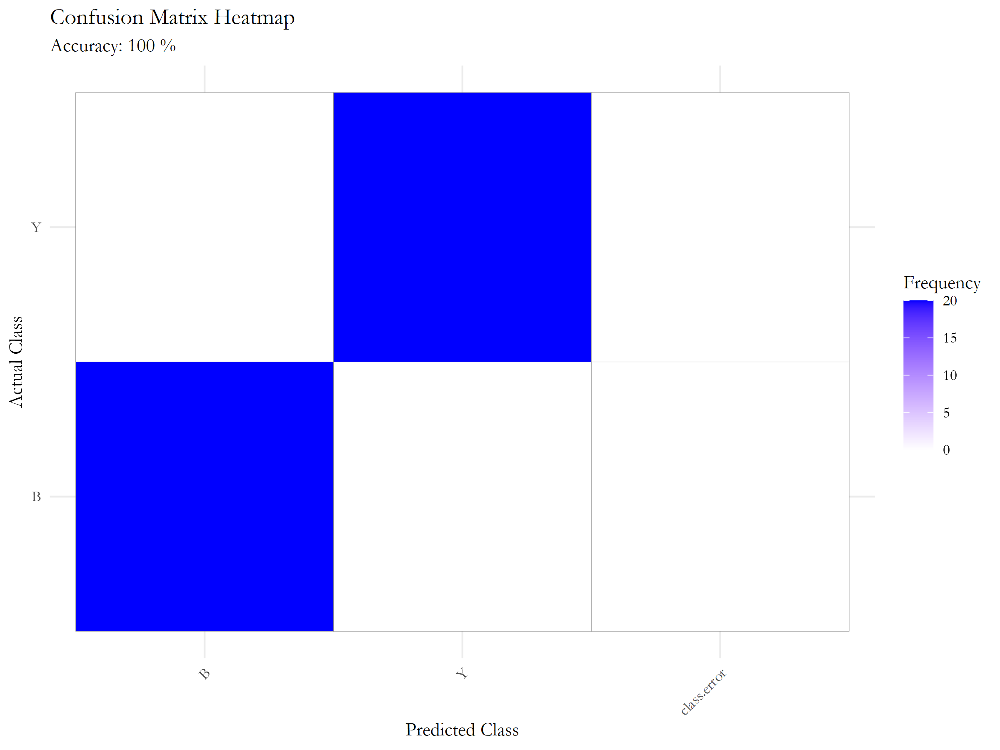  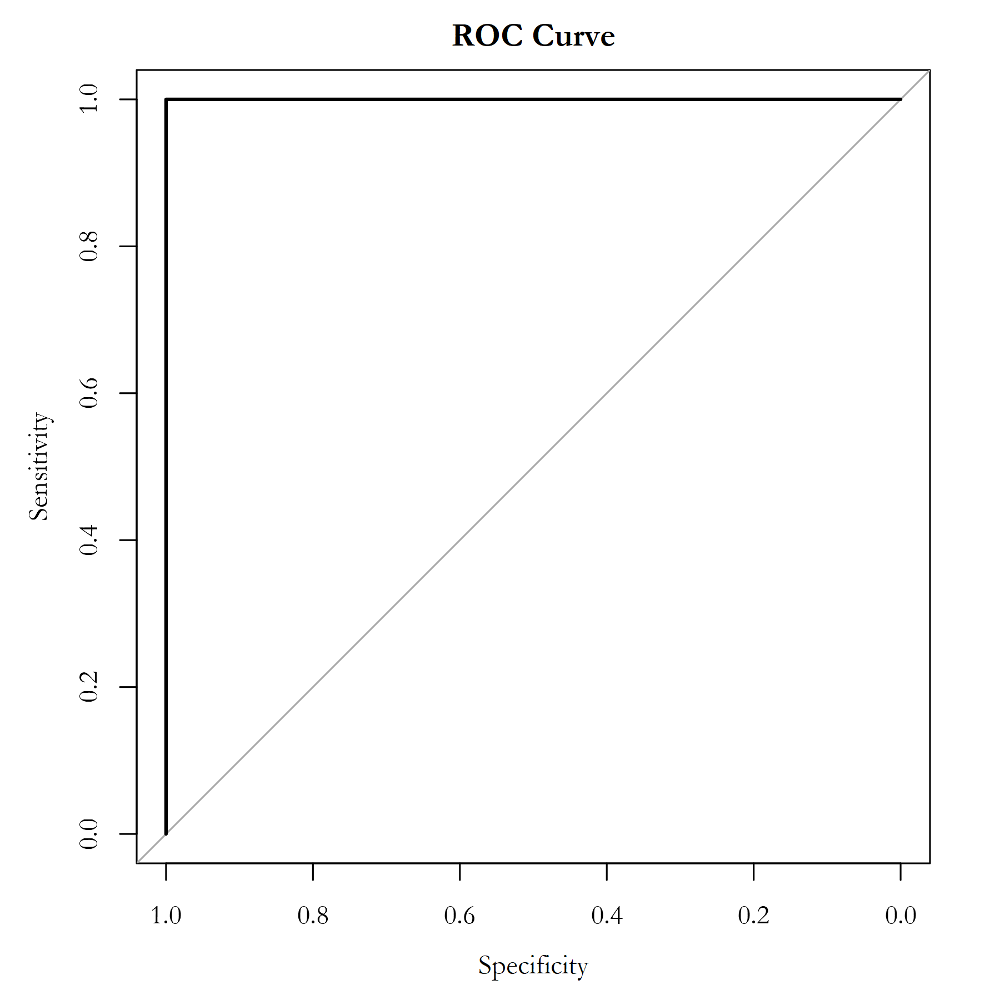  

The relative importance of each variable used in the classification model can be analyzed using the mean decrease accuracy or the Gini index. As we can see below, unsupprisingly, the most important variable to detect the frame is the a* (green to red) value of the CIE Lab color space:  
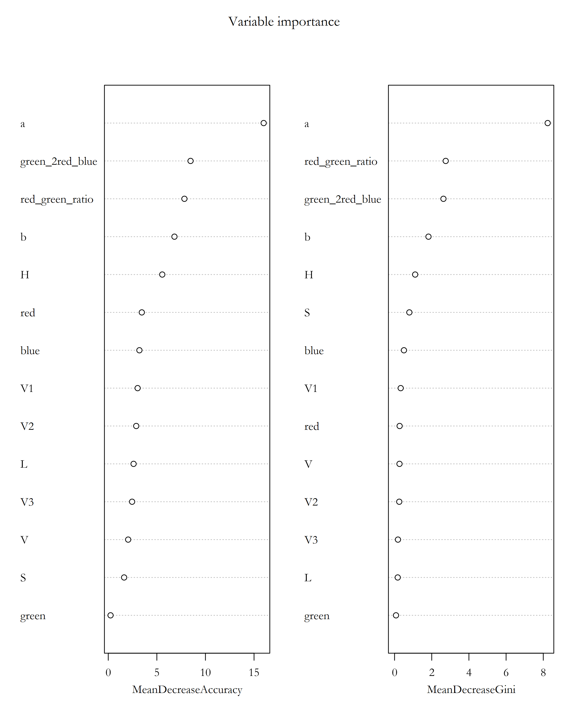  

In summary, this script automates the classification of pixels into Yam and Other categories using color data from images. It includes steps for data collection, feature extraction, model training, and saving the trained model. This workflow can be extended to multiple images and other classification tasks with similar data structures.  

<br>

## 4. Parallel Image Segmentation and Analysis for Estimating Yam Cover Percentage

This R script facilitates the parallel processing of images to classify pixels into "Yam" and "Other" categories, calculating the percentage of yam cover in each image. It begins by loading the necessary libraries, ensuring that all tools for image processing, data manipulation, and machine learning are available. The packages used include tidyverse for data manipulation, imager for image handling, colorscience for color space conversions, randomForest for the classification model, and doParallel for parallel computing.

The script loads a pre-trained Random Forest model (yam_classifier) from a file ("YamPixelClassifier.rds"). This model has been trained to distinguish between pixels that are part of the yam cover and those that are not, using various color features.  

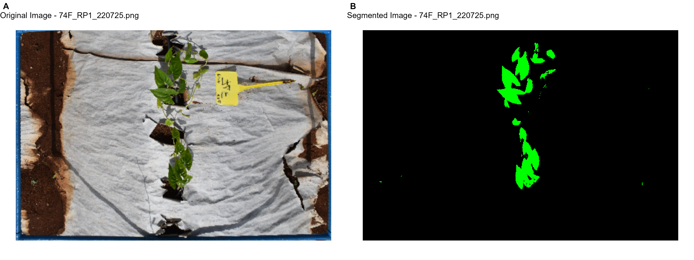 
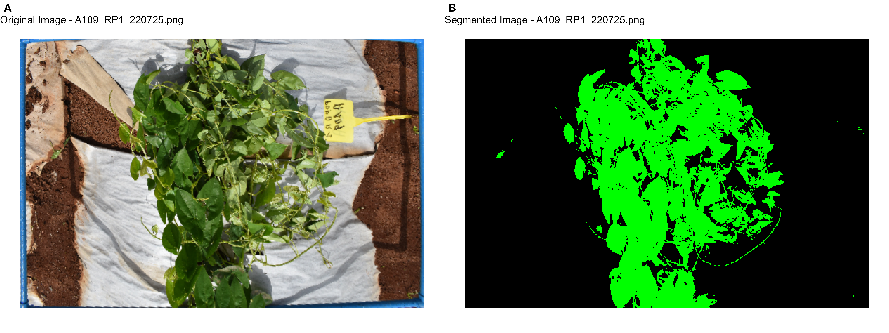
  

The script identifies all .png image files in the specified directory ("./out/CroppedFrame/") for processing. To handle potentially large datasets efficiently, it registers a parallel backend with 10 cores using the doParallel and foreach packages. This setup allows the script to process multiple images simultaneously, significantly reducing the overall computation time.

For each image, the following steps are performed:
* Image Loading and Data Conversion: The script loads the image and converts it into a data frame containing RGB values and pixel coordinates.
* Color Space Transformation and Feature Extraction: The RGB values are transformed into other color spaces (HSV, XYZ, Lab), and additional color features are calculated, such as the red-green ratio (r.g) and the difference between green and the sum of red and blue values (g2rb). These transformations provide a richer set of features for classification.
* Classification: The pre-trained Random Forest model predicts the class of each pixel, categorizing them as either "Yam" (Y) or "Other" (O). The script then calculates the percentage of pixels classified as "Yam," providing a quantitative measure of yam cover in the image.
* Results Compilation: The percentage of yam cover and the image filename are stored for each processed image.  

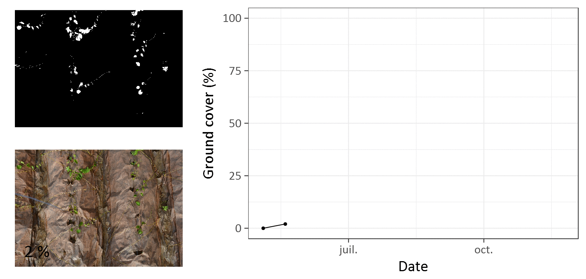 

After processing all images, the parallel cluster is stopped to release computational resources. The results, including the percentage of yam cover and metadata extracted from the image filenames, are compiled into a data frame (results_df). This data frame is then saved as a CSV file ("Yam_Cover_Percentage.csv"), providing a structured output that includes details such as the variable, replicate, and date extracted from the filenames, along with the calculated yam cover percentage.
Summary

This script automates the analysis of image datasets to estimate the percentage of yam cover, leveraging advanced image processing techniques and parallel computing. It converts raw image data into a format suitable for machine learning, applies a trained classifier, and outputs quantitative results efficiently. The use of parallel processing makes it particularly well-suited for handling large volumes of image data.  

<br>

## 5. Modeling and Analyzing Yam Ground Cover Dynamics

This R script is designed to model and analyze the dynamics of yam ground cover using data on yam coverage over time. The analysis involves several stages, including data preparation, model fitting for different growth stages, and visualization of results. Key steps include loading necessary packages, preparing the data, fitting sigmoid models to growth and senescence phases, and visualizing the dynamics.

The script begins by ensuring the availability of essential R packages: tidyverse for data manipulation and plotting, drc for dose-response curve modeling, and scales for scaling functions. A custom function InstIfNec checks if each package is installed and loads it, installing it if necessary. This setup ensures all required tools are available for the analysis.

The script starts by loading the yam coverage data from a CSV file. It processes the planting date to calculate the Day of Year (DOY) for planting and standardizes the data, including formatting dates and cleaning replicate identifiers. Initial observations where yam cover (pRec) is zero are added to account for the start of the growth phase.

The script then visualizes the raw data using ggplot2, plotting the yam ground cover percentage over time for different variables. This visualization is saved as a PNG image, providing an overview of the observed dynamics.

To model the growth phase, the script fits several sigmoid models using the drm function from the drc package, including Log-logistic (LL.3), Logistic (L.3), Gompertz (G.3u, G.3), Weibull (W1.3, W2.3), and Log-normal (LN.3) models. These models are evaluated based on AIC and BIC criteria to determine the best fit for the data.

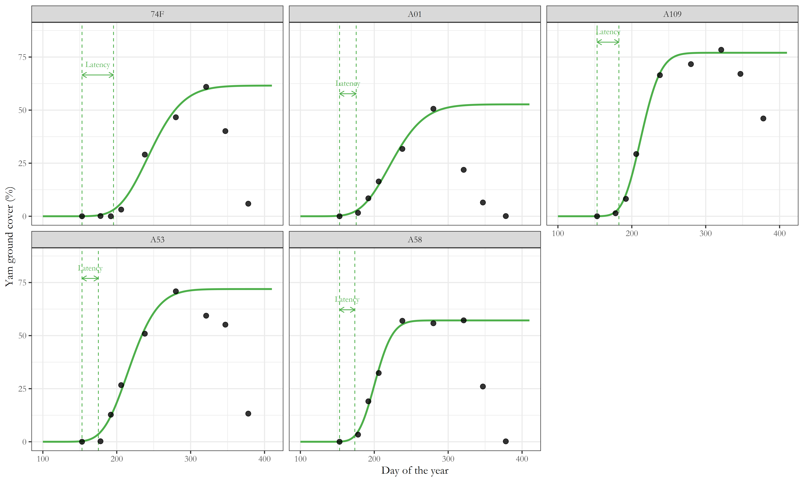 

The script extracts key parameters from the best-fitting model, such as the slope, maximum ground cover, and time to 50% cover. These parameters are used to calculate important growth traits like Latency (time to onset of significant growth) and Growth duration.

The script includes a custom function to detect plateaus in the growth curve, identifying stable phases near the peak of ground cover. This detection helps to delineate the end of active growth and the beginning of a stable phase.

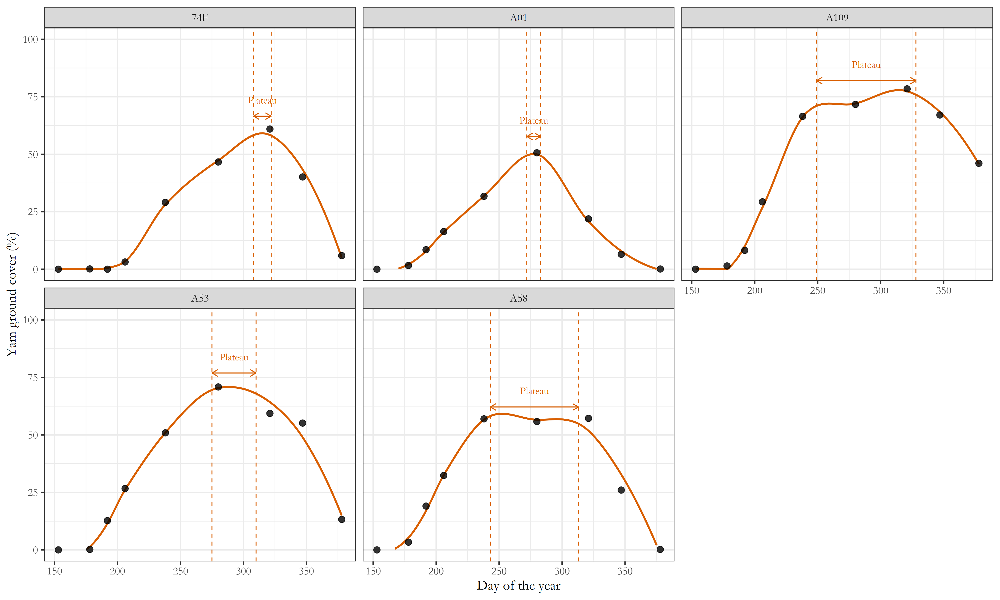 

For the senescence phase, the script again fits various sigmoid models to describe the decline in ground cover. The chosen model provides parameters that characterize the senescence process, including the rate of decline and the timing of significant decrease in coverage.

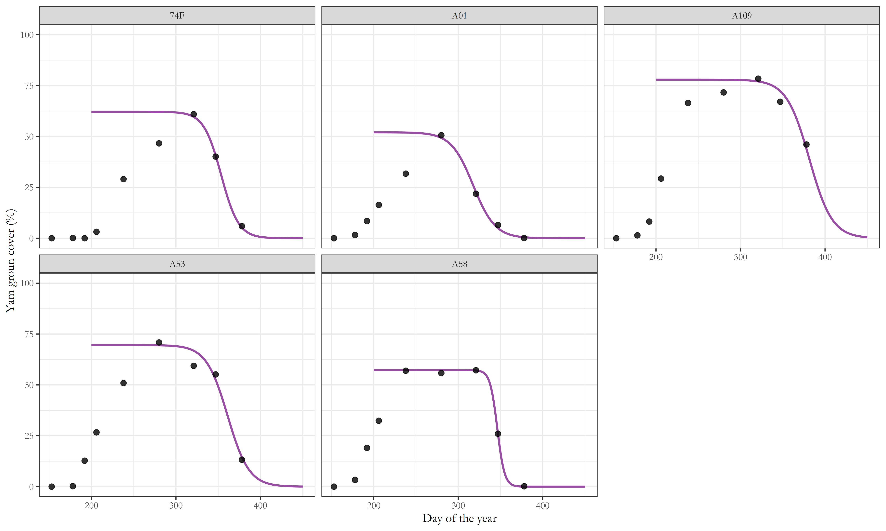 

The script visualizes the entire ground cover dynamics, highlighting different growth stages such as growth, plateau, and senescence, with corresponding model fits. It saves these visualizations as PNG files, offering a comprehensive view of the yam cover changes over time.

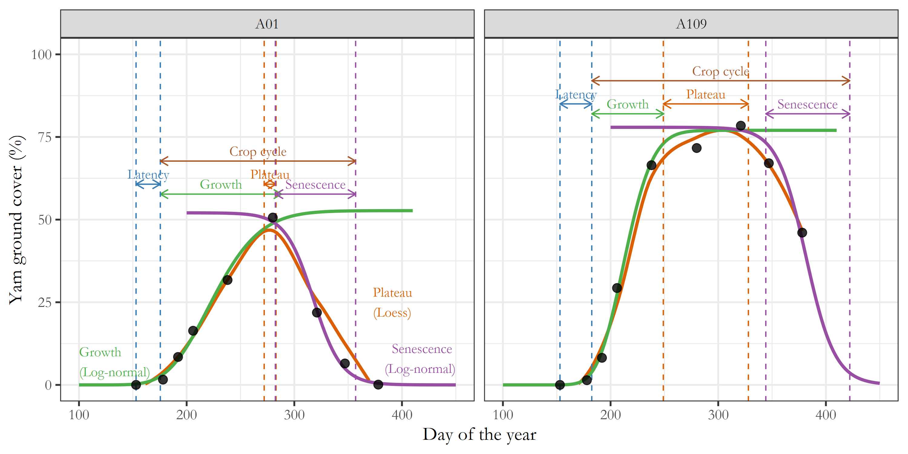 

Finally, the script compiles all the extracted parameters into a dataset and saves it as a CSV file. This dataset includes critical traits such as Latency, Growth, Plateau, and Senescence periods, providing valuable insights into the dynamics of yam ground cover across different variables.

In summary, this script offers a robust framework for analyzing yam ground cover dynamics using advanced modeling techniques and comprehensive data visualization. It allows for the extraction of key growth parameters and supports decision-making in agricultural research and practice.  

<br>


## R Libraries Overview

This repository uses various R packages for data analysis, image processing, color science, and machine learning. Below is a classification of these libraries, along with links to their official documentation.

---

### Data Manipulation and Visualization

1. **tidyverse**  
   A collection of R packages designed for data science, including `ggplot2`, `dplyr`, `tidyr`, and more.  
   [Documentation](https://www.tidyverse.org/)

2. **ggplot2**  
   A part of the tidyverse, `ggplot2` is a popular system for creating data visualizations using the grammar of graphics.  
   [Documentation](https://ggplot2.tidyverse.org/)

3. **scales**  
   Provides graphical scales to map data to aesthetics in visualization.  
   [Documentation](https://scales.r-lib.org/)

---

### Image Processing

1. **imager**  
   An image processing library for loading, processing, and analyzing image files in R.  
   [Documentation](https://dahtah.github.io/imager/)

---

### Color Science

1. **colorscience**  
   Tools for performing calculations and transformations within the realm of color science.  
   [Documentation](https://cran.r-project.org/web/packages/colorscience/colorscience.pdf)

---

### Machine Learning

1. **randomForest**  
   Implements Breiman's random forest algorithm for classification and regression.  
   [Documentation](https://cran.r-project.org/web/packages/randomForest/randomForest.pdf)

2. **drc**  
   Analyzes dose-response curves using non-linear regression models.  
   [Documentation](https://cran.r-project.org/web/packages/drc/drc.pdf)

---

### Parallel Computing

1. **parallel**  
   A base R package that provides support for parallel computation, enabling the use of multiple processor cores.  
   [Documentation](https://stat.ethz.ch/R-manual/R-devel/library/parallel/doc/parallel.pdf)

2. **doParallel**  
   Provides a parallel backend for the `foreach` package, allowing easy parallel computing.  
   [Documentation](https://cran.r-project.org/web/packages/doParallel/doParallel.pdf)

---

### Miscellaneous

1. **crayon**  
   Allows the use of colored text and styles in R terminal outputs.  
   [Documentation](https://cran.r-project.org/web/packages/crayon/crayon.pdf)

2. **tripack**  
   Provides functions for creating Delaunay triangulations and Voronoi diagrams.  
   [Documentation](https://cran.r-project.org/web/packages/tripack/tripack.pdf)

---  

<br>

## Installation

To install these packages, you can run the following code in R:

```r
packages <- c("tidyverse", "imager", "colorscience", "randomForest", "doParallel", "drc", "scales", "tripack", "crayon")
install.packages(packages)

